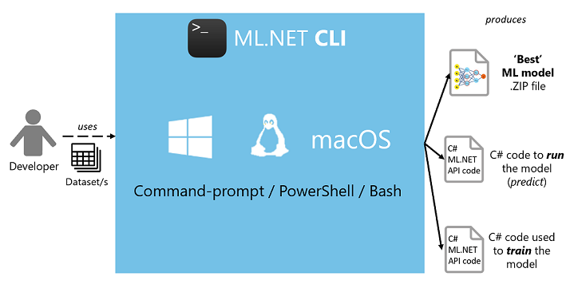
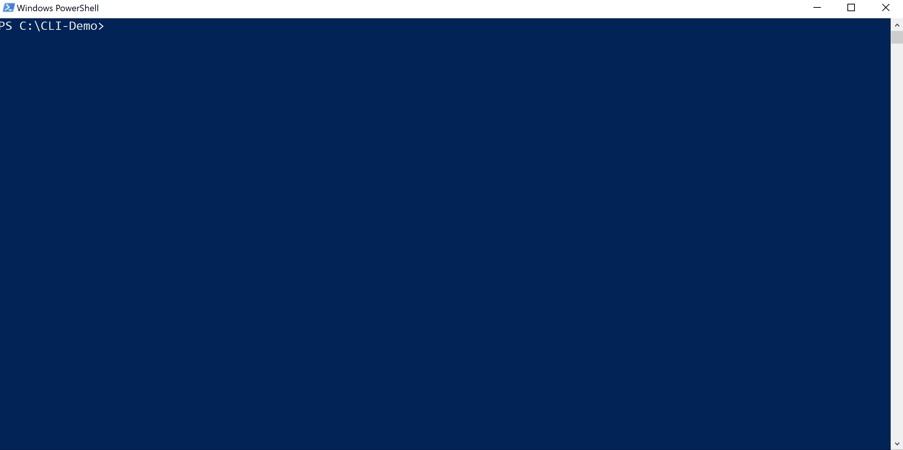

# Automate model training with the ML.NET CLI

The ML.NET CLI "democratizes" ML.NET for .NET developers when learning ML.NET.

To use the ML.NET API, you need to choose a trainer (implementation of a machine learning algorithm for a particular task), as well as the set of data transformations to apply to your data. The configuration can vary with the algorithm and the training dataset. Complexity can be a problem here as there are many algorithms to choose from such as logistic regression, support vector machine (SVM), lasso regression, ridge regression, stochastic dual coordinate ascent (SDCA) and many more. Even further, each algorithm has a set of hyper-parameters that must be tuned. Hyper-parameters for each of the algorithms can be an infinite set to choose from. Hence, you can spend weeks and some times months training several machine learning models with different combinations of learning algorithms, hyper-parameters, and features.

This process can be automated with the ML.NET CLI, which implements the ML.NET AutoML intelligent engine. 

> [!NOTE]
> This topic refers to ML.NET **CLI** and ML.NET **AutoML**, which are currently in Preview, and material may be subject to change. 

## What is the ML.NET Command-line Interface (CLI)?

You can run the ML.NET CLI on any command-prompt (Windows, Mac, or Linux) for generating good quality ML.NET models and source code based on your training dataset.

As show in the figure below, it is simple to generate a good quality ML.NET model (serialized model .zip file) plus the sample C# code to run/score that model. In addition, the C# code to create/train that model is also generated, so that you can research the algorithm and settings used for that generated "best model". 



You can generate those assets from your own datasets without coding by yourself, so it also improves your productivity even if you already know ML.NET.

Currently, the ML Tasks supported by the ML.NET CLI are:

- `binary-classification`
- `multiclass-classification` 
- `regression`
- Future: other machine learning tasks such as `recommendation`, `anomaly-detection`, `clustering`

Example of usage:

```console
> mlnet auto-train --task binary-classification --dataset "customer-feedback.tsv" --label-column-name Sentiment
```



You can run it the same way on *Windows PowerShell*, *macOS/Linux bash, or *Windows CMD*. However, tabular auto-completion (parameter suggestions) won't work on *Windows CMD*.

## Output assets generated

In the destination paths highlighted in by the tool when finishing the process, the CLI auto-train command generates the following assets:

- A serialized model .zip ("best model") ready to use for running predictions. 
- C# solution with:
    - C# code to run/score that generated model (To make predictions in your end-user apps with that model).
    - C# code with the training code used to generate that model (Learning purposes).
- Log file with information of all iterations/sweeps across the multiple algorithms evaluated, including their detailed configuration/pipeline.

The first two assets can directly be used in your end-user apps (ASP.NET Core web app, services, desktop app, etc.) to make predictions with that generated ML model.

The third asset, the training code, shows you what ML.NET API code was used by the CLI to train the generated model, so you can investigate what specific trainer/algorithm and hyper-parameters were selected by the CLI and AutoML under the covers. 

## Understanding the quality of the model

When you generate a 'best model' with the CLI tool, you see quality metrics (such as accuracy, RSquare) that are different depending on the ML task you are targeting. 

Here we summarize those metrics grouped by ML task so you can understand the quality of your auto-generated 'best model'.

### Metrics for Binary Classification models

You will see a similar list of metrics for the best top five quality models found by the CLI. In this particular case related to a binary classification ML task:


Accuracy is a popular metric for classification problems, however accuracy is not always the best metric to select the best model from as explained in the references below. There are cases where you need to evaluate the quality of your model with additional metrics.

To explore and understand the metrics that are output by the CLI, see [Metrics for binary classification](resources/metrics.md#metrics-for-binary-classification).

### Metrics for Multi-class Classification models

You will see a similar list of metrics for the best top five quality models found by the CLI. In this particular case related to a multi-class classification ML task:


To explore and understand the metrics that are output by the CLI, see [Metrics for multiclass classification](resources/metrics.md#metrics-for-multi-class-classification).

### Metrics for Regression models

A regression model fits the data well if the differences between the observed values and the model's predicted values are small and unbiased. Regression can be evaluated with certain metrics.

You will see a similar list of metrics for the best top five quality models found by the CLI. In this particular case related to a regression ML task:


To explore and understand the metrics that are output by the CLI, see [Metrics for regression](resources/metrics.md#metrics-for-regression).

## See also

- [How to install the ML.NET CLI tool](how-to-guides/install-ml-net-cli.md)
- [Tutorial: Auto generate a binary classifier using the ML.NET CLI](tutorials/mlnet-cli.md)
- [ML.NET CLI command reference](reference/ml-net-cli-reference.md)
- [Telemetry in ML.NET CLI](resources/ml-net-cli-telemetry.md)